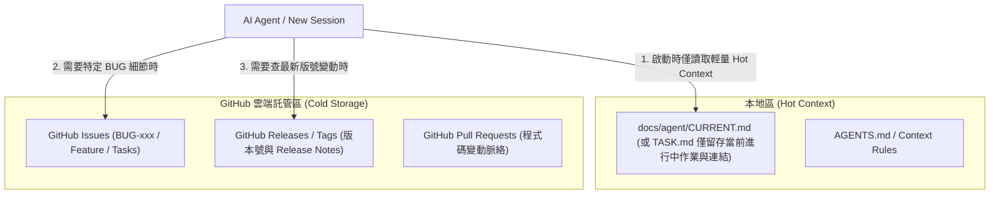

# GitHub 託管交接文件與 Token 最佳化架構方案

## 1. 概述與背景 (Goal & Background)

目前本專案的交接文件與歷史紀錄皆以本地 `.md` 檔案形式存放在 `docs/agent/` 目錄中。
累積至今，歷史紀錄檔案總體積已超過 **900 KB**（例如 `PROGRESS_ARCHIVE.md` 達 343KB、`CHANGELOG.md` 達 102KB、`FIXED_BUG.md` 達 61KB）。

### 現行架構的主要痛點：
1. **Token 消耗巨大**：當新的 Agent 或 Session 啟動並閱讀歷史文件或搜尋脈絡時，全量載入這些大檔案會瞬間消耗數十萬至上百萬 Token。
2. **Context Window 污染**：大量冷歷史（已修復的舊 BUG、過期排程驗證 Log）佔據 Context 空間，反而降低 Agent 處理目前任務的專注度與推理精準度。
3. **維護與比對成本高**：手動在多個 `.md` 檔案間搬移內容，增添寫入與同步負擔。

---

## 2. 核心方案：分層快取架構 (Layered Context Architecture)

採取 **「熱資料在本地（Hot Context）、冷資料在 GitHub（Cold Storage）」** 的混合架構：

### 職責分工：

1. **GitHub Issues (替代 BUG_FIX.md / FIXED_BUG.md / TASK.md 舊細節)**
   - **BUG 追蹤**：新發生的每一個 BUG 建立獨立的 GitHub Issue（如 `#26 BUG-026 借券翻日後短路`）。
   - **內容包含**：重現步驟、Log 截圖/片段、Root Cause、Fix 方案與對應的 PR/Commit。
   - **Token 效益**：Agent 只要執行 `gh issue view 26`，即可取得完全聚焦且精準的 1~2KB 資訊，無需載入 61KB 的全量歷史 BUG 檔。

2. **GitHub Releases & Tags (替代 CHANGELOG.md 大檔)**
   - **版本號發布**：每次 Release（如 `v0.7.13`）直接發布至 GitHub Release。
   - **本地留存**：本地 `CHANGELOG.md` 轉為「版本索引表」，僅保留版號、日期與 Release 連結，舊版號內容直接歸檔至 GitHub Releases。

3. **超精簡熱狀態**
   - **內容結構**：
     - **Current Milestone & Goal**（當前里程碑與目標）
     - **Active Tasks & Issues**（進行中的工作項目，附帶 GitHub Issue 號碼）
     - **System Constraints & Rules**（關鍵架構約束）

---

## 3. 轉移與執行建議步驟 (Implementation Steps)

1. **GitHub Workflow 整合**：後續發生新 BUG 時，透過 `gh issue create` 建立 Issue；完成修復時更新狀態與 commit。
2. **Release 流程**：未來版本發布時，發布至 GitHub Release 頁面。
3. **按需檢索 (On-Demand Retrieval)**：新 Session 的 Agent 依需要透過 `gh issue` 或 API 查詢細節，不再需要預先載入歷史大檔案。

---

## 4. 驗證與效益評估 (Benefits)

- **Token 節省率**：在新 Session 初始化與載入脈絡時，文檔讀取 Token 數預計可降低 **85% - 95%**。
- **資訊檢索速度**：Agent 透過 `gh issue view` 或 API 按需查詢特定 BUG，避免無謂的大檔案全檢。
- **無資訊遺漏**：透過 Issue ID 與 GitHub API 精準連結，確保完全不遺漏關鍵討論與歷史修復過程。

---

## 5. Verdict (2026-08-12) — **REJECTED except for Releases**

Written in English per CLAUDE.md § Memory. **Do not re-propose the Issues migration without
first re-running the measurements below.** The diagnosis in §1 was right that the docs are
oversized; the prescription in §2 targeted the wrong files.

### 5.1 The token premise does not hold

§1 assumes the large files are loaded. They are not. `CLAUDE.md` § Start of session lists
exactly three files, and `grep -rn "ARCHIVE"` over `CLAUDE.md` / `.claude/agents/` /
`.claude/skills/` returns only **write** destinations — no instruction anywhere reads an archive.

| File | chars | read at session start? |
| ---- | ---- | ---- |
| `PROGRESS_ARCHIVE.md` | 219k | no |
| `TASK_ARCHIVE.md` | 146k | no |
| `CHANGELOG.md` | 48k | no |
| `PROGRESS.md` | 69k | **yes** ("top only", previously unbounded) |
| `TASK.md` | 26k | **yes** |
| `BUG_FIX.md` | 6k | **yes** |

The 413k characters the plan proposed to move (63% of the corpus) cost **zero** today. The
claimed 85–95% saving is measured against a baseline that never occurs. The real cost was
`PROGRESS.md`: 1272 lines, 25 log entries, of which the newest two ended at line 235 — **82% of
a hot file was cold data**, because "read top only" had no mechanical boundary.

### 5.2 Retrieval would get worse, not cheaper

These docs exist to answer cross-cutting investigative questions. A worked example: answering
"why does 月營收 probe at 12:00" required substring hits across `PROGRESS.md`,
`PROGRESS_ARCHIVE.md`, `TASK.md`, `CHANGELOG.md`, `supabase/schema.sql`, plus `git log -S` —
six cheap `grep -rn` calls returning exact lines.

GitHub Issues cannot serve that shape of query: `gh search issues` is fuzzy full-text and
rate-limited, hits must then be fetched one network round-trip at a time, there is no `git log -S`
equivalent, and `schema.sql` (where much of the rationale actually lives) would not move — so
retrieval splits into two mechanisms. It also makes the memory layer network-dependent, in a
project whose work is already exposed to Supabase/Edge network flakiness.

### 5.3 The security objection is about the gate, not the content

Measured, not assumed:

- `gh repo view --json visibility` → **PUBLIC**. `docs/agent/` is already world-readable, so
  migrating changes **no** exposure surface for existing content.
- `gh api repos/CTJ425/stock-pnl-web --jq .security_and_analysis` →
  `secret_scanning_push_protection: **enabled**`. Committed credentials are blocked at `git push`.
- **Issue bodies are not covered by push protection.** They are public the instant
  `gh issue create` returns, and edits do not un-publish them.

§2 item 1 of this plan explicitly specifies that BUG issues carry 「Log 截圖/片段」. This project's
Edge logs and `cron.job.command` carry `x-cron-secret` and Supabase keys — and a redaction regex
has already failed once, printing the DEV `CRON_SECRET` into a session transcript (see `TASK.md`
Task 87 operational note). The migration would move the single most secret-prone content type
from a gated channel to an ungated one. Secondary: routine doc **reads** would start depending on
a `gh` token carrying `repo`+`workflow`+`gist` scope; today reading docs needs no credential.

### 5.4 What was done instead

1. `PROGRESS.md` capped at header + newest 2 log entries; the rest rolled to `PROGRESS_ARCHIVE.md`.
2. `TASK.md` slimmed — `✅` entries moved out, `~~struck~~ ✅` sub-items collapsed to a `**Done**:` line.
3. Archives **stay local**. Free until grepped; `grep`/`git log -S` is the cheapest retrieval here.
4. GitHub **Releases** adopted for official `x.x.x` only (`versioning` skill § GitHub Releases).
   `CHANGELOG.md` remains the source of truth; the Release is a mirror. Issues were **not** adopted.

Caps are enforced by `.claude/agents/scribe.md` § Size caps, and the public-repo log rule by
`CLAUDE.md` § This repo is public.
